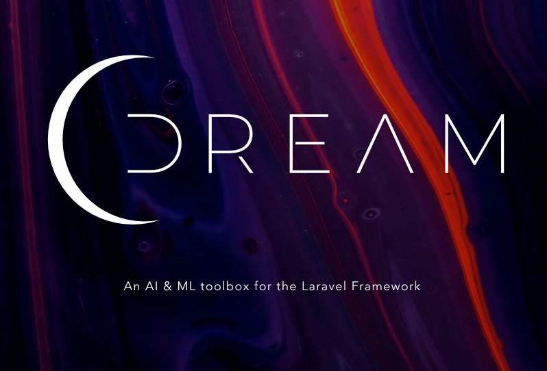

# An AI/ML toolbox for Laravel

[](https://packagist.org/packages/christopherarter/dream)
[](https://packagist.org/packages/christopherarter/dream)


Dream is a package for Laravel that brings common AI/ML tools into your Laravel application without all the boilerplate.
Currently, it only supports **AWS Comprehend**. However, more drivers and tools will be added.

## Requirements

- PHP 8.1
- Laravel 9

## Getting Started

### Installation

You can install the package via composer:

```bash
composer require christopherarter/dream
```

Next, publish the vendor config file:
```bash
php artisan vendor:publish --provider="Dream\DreamServiceProvider"
```

### Setup AWS Credentials

Next, set up your AWS credentials in your `.env` file. **Note: the user must have access to the AWS Comprehend service.**

```dotenv
AWS_ACCESS_KEY_ID=your-access-key
AWS_SECRET_ACCESS_KEY=your-secret-key
```


---
## Usage

To use this package, you can rely on the `Dream` facade. This facade will automatically use the default driver you have set in your `config/dream.php` file.

```php
use Dream\Facades\Dream;
```

### Sentiment Analysis
Sentiment analysis is the process of determining whether a piece of writing is positive, negative, or neutral. It's also known as opinion mining, deriving the opinion or attitude of a speaker.
Dream includes several helper methods to make it easy to use sentiment analysis.

Example:
```php
use Dream\Facades\Dream;

$sentiment = Dream::sentiment('I love Laravel!');
$sentiment->disposition(); // 'positive';
$sentiment->positive(); // true;
```

Available Methods:
```php
use Dream\Facades\Dream;

$sentiment->disposition(); // 'positive' | 'negative' | 'neutral';
$sentiment->positive(); // true | false;
$sentiment->negative(); // true | false;
$sentiment->neutral(); // true | false;
```

### Entity Extraction
Entity extraction is the process of detecting and classifying key information from text and other unstructured data sources. 
It's also known as named entity recognition (NER).

```php
use Dream\Facades\Dream;

$entities = Dream::entities('I need a reservation for Mr. Foo and Mr. Bar at 
the Foo Bar Restaurant on October 31st.');

$entities->people()->toArray(); // ['Mr. Foo', 'Mr. Bar'];
$entities->places()->toArray(); // ['Foo Bar Restaurant'];
$entities->dates()->toArray(); // ['October 31st'];
```

Available Methods:
```php
$entities->people(); // Collection of people
$entities->places(); // Collection of places
$entities->dates(); // Collection of dates
$entities->organizations(); // Collection of organizations
$entities->events(); // Collection of events
$entities->products(); // Collection of products
$entities->quantities(); // Collection of quantities
$enteties->other(); // Collection of other entities
```

### Key Phrase Extraction
Key phrase extraction is the process of identifying the most important phrases in a block of text.
Dream includes the ability to extract key phrases from a string.

```php
use Dream\Facades\Dream;

Dream::keyPhrases('Laravel is a web application framework with expressive, 
elegant syntax. We’ve already laid the foundation — freeing you to create 
without sweating the small things.')
  ->pluck('text')
  ->toArray();
  
// [
//   "Laravel",
//   "a web application framework",
//   "expressive, elegant syntax",
//   "the foundation —",
//   "the small things",
// ]
```
---
## Clients

### AWS Comprehend

Currently, Dream only supports [AWS Comprehend](https://aws.amazon.com/comprehend/). 
However, more clients will be added very soon.

#### IAM Configuration

The AWS user you provide will need to have access to the Comprehend service.

Here's a policy example:
```json
{
    "Version": "2012-10-17",
    "Statement": [
        {
            "Action": [
                "comprehend:*",
            ],
            "Effect": "Allow",
            "Resource": "*"
        }
    ]
}
```

If you'd like to strictly adhere to [least privilege](https://docs.aws.amazon.com/IAM/latest/UserGuide/best-practices.html#grant-least-privilege), you can limit the Actions in the role
to just the ones you need. For example, if you only need to use the `entities` method, you can limit the Actions to just `comprehend:DetectEntities`.

#### Environment Variables

By default, Dream will use the `AWS_ACCESS_KEY_ID` and `AWS_SECRET_ACCESS_KEY` environment variables to authenticate with AWS Comprehend.
If you would like to specify a different AWS key & secret to use with Dream,
you can do so by setting the keys with the `DREAM_` prefix.

For example, 

```dotenv
DREAM_AWS_ACCESS_KEY_ID=your-key
DREAM_AWS_SECRET_ACCESS_KEY=your-secret
```

### Azure Cognitive Services
Coming soon :)

---

### Building Custom Clients

If you would like to build your own client, or contribute to this project by
adding another client from a different provider, you can do so by extending the
`Dream\Clients\Client` class.

You should extend this class, and implement each method your client will support.

```php
<?php

use Dream\Clients\Client;
use Dream\Collections\TextEntityCollection;
use Illuminate\Support\Collection

class MyCustomClient extends Client
{
    public function sentiment(string $text, $language = 'en'): Sentiment
    {
        // Your code here
    }

    public function entities(string $text, $language = 'en'): TextEntityCollection
    {
        // Your code here
    }

    public function keyPhrases(string $text,  $language = 'en'): Collection
    {
        // Your code here
    }
}
```
Next, you'll add your client to the `config/dream.php` file.

```php
<?php

return [
    'connections' => [
        // ...
        'my-custom-client' => [
            'driver' => MyCustomClient::class,
        ],   
    ],
];
```

Finally, you'll set your client as the default driver in your environment. Here's an example in your `.env`:

```dotenv
DREAM_DRIVER=my-custom-client
```

### Testing

```bash
composer test
```

## Roadmap
- [ ] Add OCR & Image Recognition
- [ ] Add support for Azure Cognitive Services
- [ ] Add support for Google Natural Language
- [ ] Add support for OpenAI

## Contributing

Please see [CONTRIBUTING](CONTRIBUTING.md) for details.

### Security

If you discover any security related issues, please email chris@arter.dev instead of using the issue tracker.

## Credits

- [Chris Arter](https://github.com/christopherarter)
- [All Contributors](../../contributors)

## License

The MIT License (MIT). Please see [License File](LICENSE.md) for more information.
